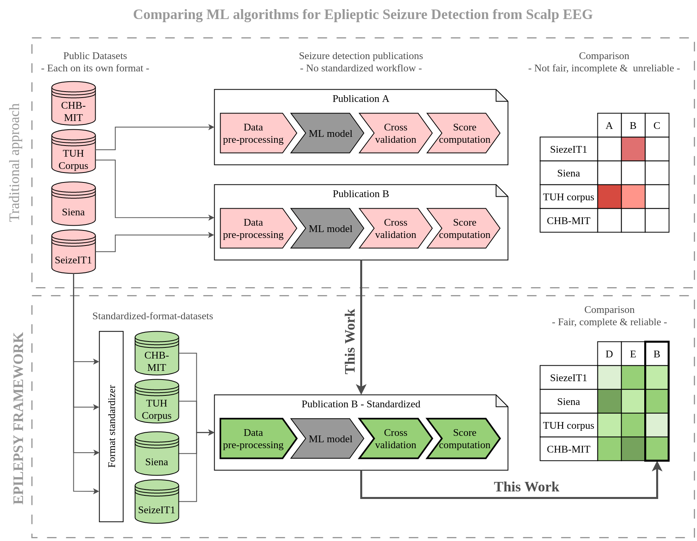

## Reproduction and Integration of Epileptic Seizure Detection Algorithm into EPILEPSY BENCHMARKS
---
## Regular Lost Functions - CS-433 - Project 2 (ML4Science) - Fall 2023
### Authors: Mridhula Venkatanarayanan, Juan Sapriza & Kenta Yokote
### Hosting Lab: Embedded Systems Laboratory - EPFL, Lausanne
### Under supervision of Dr. Jonathan Dan
---

## Introduction

Machine Learning (ML) has become a popular approach for the detection of epiletic seizures from Electroencephalograms (EEG). During the last years several datasets have been produced, both public and private. At the same time, abundant research has been carried out but without much consensus on the dataset to use, data format, cross-validation approach or figures of merit.
In this light, the Embedded Systems Laboratory from EPFL is developing a standarization framework for seizure detection algorithms: [EPILEPSY BENCHMARKS](https://eslweb.epfl.ch/epilepsybenchmarks/framework/#tuh). Its goal is to harmonize the work of algorithm developers to offer a fair comparison between approaches.

Our objectives during this project, listed in Figure 1, include taking a State-of-the-Art publication and:
1. Reproduce its reported results.
2. Adapt the algorithm to work with the standardized-format dataset.
3. Adapt the algorithm to perform the standardized cross-validation approach.
4. Obtain the benchmark's figure of merits.
5. Submit the results to the EPILEPSY BENCHMARKS online platform.
6. Re-run the algorithm with all other standaridized-format datasets.

Figure 1: Workflow of comparing epileptic-seizure-detection machine learning publications, traditional approach vs. the EPILEPSY BENCHMARKS workflow. This work involves adapting a publication to fit the standards of the platform.

---

## Baseline Publication

To choose a baseline publication we applied the following criteria:
* Performs epileptic seizure detection based on scalp EEG.
* Uses a ML approach.
* Validated on one of the benchmark's datasets.
* Available code.

Based on those points we chose:

**Automatic Detection of Epileptic Seizures with Recurrent and Convolutional Neural Networks**
> Carrión, S., López-Chilet, Á., Martínez-Bernia, J., Coll-Alonso, J., Chorro-Juan, D., Gómez, J.A. (2022). Automatic Detection of Epileptic Seizures with Recurrent and Convolutional Neural Networks. In: Mazzeo, P.L., Frontoni, E., Sclaroff, S., Distante, C. (eds) Image Analysis and Processing. ICIAP 2022 Workshops. ICIAP 2022. Lecture Notes in Computer Science, vol 13373. Springer, Cham. https://doi.org/10.1007/978-3-031-13321-3_46

The code, [accessible on Github](https://github.com/deephealthproject/UC13_pipeline) was cloned from commit `20b24a3`.

